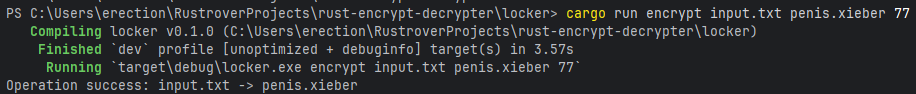

# Rust Encrypt / Decrypt

---

# A project I started to improve my skillset in the Rust language.
Works as follows:

---

## How does it work?
It uses a combination of xor encryption and bit rotation to scramble each byte of a file. Every byte of data is first xored (^) with the number provided by the user. The xor operation flips bits where the key has a 1, making the data unreadable without the same key.
 
After that, each byte is rotated in it's own way, either left or right. Each byte is transformed differently which increases the "randomness".

Decrypting simply just reverses the steps made to encrypt it.

## Why this project?
I am generally interested in cryptography and encryption. That's it. It is also a nice little project to learn Rust.
